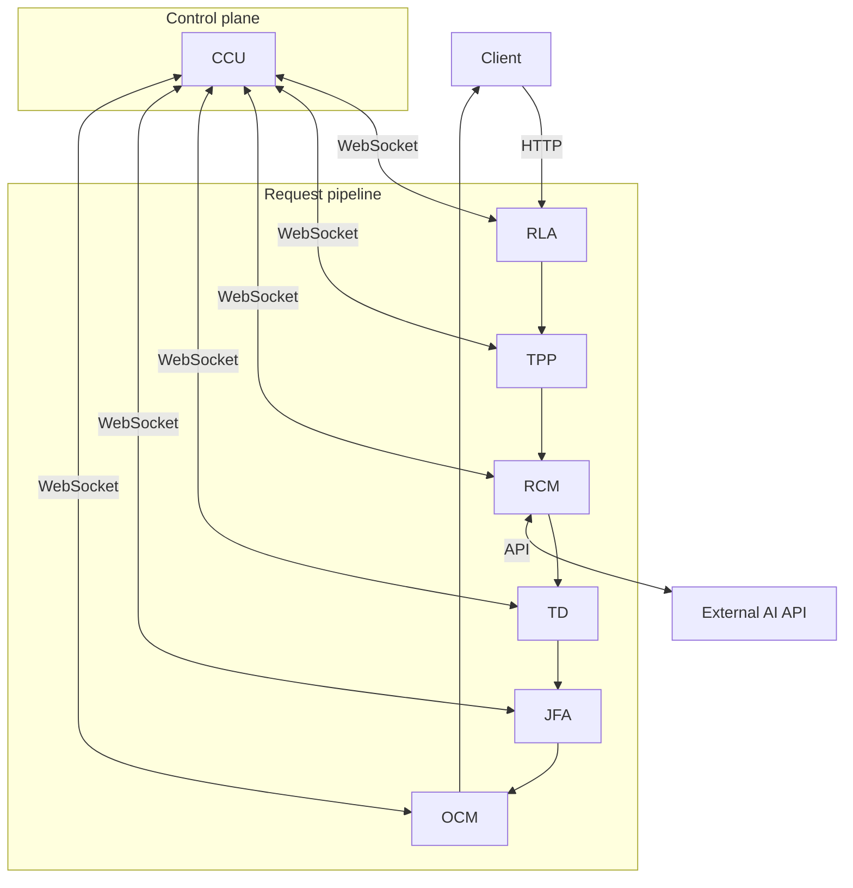

# Horus

**Distributed AI request orchestration in Python — a portfolio-grade microservice platform.**

Horus sits between client applications and external AI APIs. It validates ingress, preprocesses text, calls AI providers asynchronously, routes tasks through a proxy pipeline, and delivers formatted responses — all supervised by a central control plane.


> **Release:** `v0.1.0-alpha` — see [CHANGELOG.md](./CHANGELOG.md)

---

## What Horus is

- A **seven-service backend** with clear control/data plane separation
- A **pure proxy** — no embedded domain computation (electrical, geo, industry solvers)
- A **demonstration** of Python microservice patterns: FastAPI, WebSockets, priority queues, modular packages

See [Design principles](./docs/design-principles.md) for scope boundaries.

---

## Architecture



| Service | Role |
|---------|------|
| **CCU** | Central control — orchestration, monitoring, TLS |
| **RLA** | Gateway — HTTP ingress, validation, rate limits |
| **TPP** | Text preprocessing and filtering |
| **RCM** | AI API I/O, priority queues, caching |
| **TD** | Task routing proxy (`forward` / `parallel` / `sequential`) |
| **JFA** | Job flow analysis and quality metrics |
| **OCM** | Output formatting and delivery |

Full detail: [docs/architecture.md](./docs/architecture.md)

---

## Quick start

```bash
python -m venv .venv && .venv\Scripts\activate   # Windows
pip install -r requirements/dev.txt
cp .env.example .env

python horus_startup.py --status
python horus_startup.py --start
```

Mock servers: `python mocks/website_server.py` · `python mocks/openai_server.py`

Docker: `docker compose --profile mocks up`

---

## Documentation

| Guide | Description |
|-------|-------------|
| [Architecture](./docs/architecture.md) | Services, control/data plane, startup |
| [Design principles](./docs/design-principles.md) | Scope, proxy model, conventions |
| [Development](./docs/development.md) | Setup, lint, conventions |
| [Deployment](./docs/deployment.md) | Docker, systemd, TLS |
| [Testing](./docs/testing.md) | pytest layout and CI |
| [Contributing](./CONTRIBUTING.md) | PR guidelines |
| [Security](./SECURITY.md) | Vulnerability reporting |

---

## Project layout

```text
services/           # ccu, rla, rcm, tpp, td, jfa, ocm
mocks/              # Integration test servers
horus_startup.py    # Orchestrator
docs/               # Consolidated documentation
requirements/       # base.txt + dev.txt
pyproject.toml
```

---

## Tech stack

Python 3.13 · FastAPI · WebSockets · aiohttp · pytest · ruff · Docker

---

## License

MIT — see [LICENSE.txt](./LICENSE.txt)
