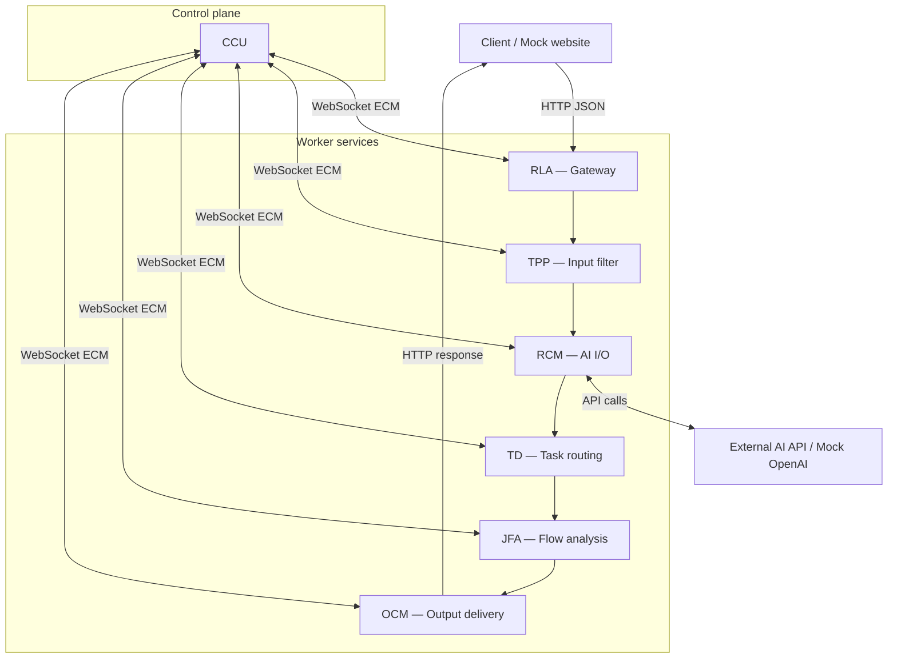

# Architecture

Horus is a seven-service Python backend for orchestrating AI API requests. A central control plane (CCU) supervises six worker services over WebSocket; request payloads flow over HTTP between services and external clients.

## System diagram



## Control vs data plane

| Plane | Mechanism | Purpose |
|-------|-----------|---------|
| Control | WebSocket (CCU interaction modules ↔ service ECM) | Lifecycle, activation, heartbeats, commands |
| Data | HTTP / FastAPI | Ingress, AI API calls, formatted responses |

CCU exposes six WebSocket servers (RLAIM, TPPIM, RCMIM, JFAIM, TDIM, OCMIM). Each worker connects its External Control Module (ECM) as a client.

## Request lifecycle

1. **RLA** — Receives JSON, validates schema, enforces limits and spam checks.
2. **TPP** — Preprocesses and sanitizes text.
3. **RCM** — Queues by priority, calls external AI APIs asynchronously, caches responses.
4. **TD** — Generic task routing proxy for multi-step workflows.
5. **JFA** — Analyzes job flow and quality metrics.
6. **OCM** — Formats output (JSON, HTML, PDF) and delivers to the caller.

Request IDs use the format `wsrid_0x<12-digit-hex>` and are tracked across the pipeline (CCU RTM).

## Startup sequence

`horus_startup.py` runs three phases:

1. **Phase 1** — Start CCU and verify WebSocket servers on ports 4441–4446.
2. **Phase 2** — Start RLA, TPP, RCM, TD, JFA, OCM; activate gateways where required.
3. **Phase 3** — Verify ECM connections; fail if any service or connection is missing.

```bash
python horus_startup.py --start
python horus_startup.py --status
python horus_startup.py --stop
```

## Service reference

| Service | Entry point | Default HTTP port |
|---------|-------------|-------------------|
| CCU | `services/ccu/ccu.py` | 11489 (health) |
| RLA | `services/rla/RLA_main.py` | 3781 |
| TPP | `services/tpp/TPP_main.py` | 8004 |
| RCM | `services/rcm/RCM_main.py` | 8002 |
| TD | `services/td/TD_main.py` | 8003 |
| JFA | `services/jfa/JFA_Main.py` | 8001 |
| OCM | `services/ocm/ocm.py` | 8082 |

Per-service module breakdown:

- [CCU](../services/ccu/README.md)
- [RLA](../services/rla/) — gateway modules (GVDM, LEM, SVM, ECM, …)
- [RCM](../services/rcm/README.md)
- [TPP](../services/tpp/)
- [TD](../services/td/README.md)
- [JFA](../services/jfa/)
- [OCM](../services/ocm/README.md)

## Design patterns

- **Modular packages** — One Python package per functional module (e.g. `ECM`, `EMM`, `TMM`).
- **Circuit breaker & backpressure** — CCU MSMM/SRMM monitor health and resource usage.
- **Priority queues** — RCM processes tiers A–D under load.
- **Central configuration** — CCU SMM and `config/paths/global_paths.json` drive paths and settings.

## Path configuration

Runtime paths are defined in [`config/paths/global_paths.json`](../config/paths/global_paths.json). The CCU PMM resolves the installation root from `HORUS_ROOT`, or by detecting `services/` and `README.md` at the repo root.

## Scope boundaries

Horus is a **pure proxy** — it orchestrates AI API traffic and routes tasks through the pipeline. It does not ship domain computation engines, geo databases, or industry-specific solvers. See [Design principles](./design-principles.md).
